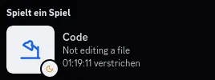
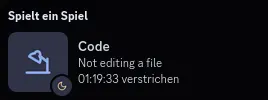

<h3 align="center">
	<br/>
	
	Catppuccin for <a href="https://marketplace.visualstudio.com/items?itemName=LeonardSSH.vscord">VSCord</a>
	
</h3>

<p align="center">
	<a href="https://github.com/catppuccin/vscord/stargazers"></a>
	<a href="https://github.com/catppuccin/vscord/issues"></a>
	<a href="https://github.com/catppuccin/vscord/contributors"></a>
</p>

<p align="center">
	
</p>

## Previews

<details>
<summary>🌻 Latte</summary>

</details>
<details>
<summary>🪴 Frappé</summary>

</details>
<details>
<summary>🌺 Macchiato</summary>

</details>
<details>
<summary>🌿 Mocha</summary>

</details>

## Usage

1. Install the [VSCord](https://marketplace.visualstudio.com/items?itemName=LeonardSSH.vscord) extension if you haven't already.
2. Add the following to your `settings.json` and replace `flavor` by your preferred flavor.

```json
{
  "vscord.status.image.large.debugging.key": "https://catppuccin.github.io/vscord/flavor/debugging.webp",
  "vscord.status.image.large.editing.key": "https://catppuccin.github.io/vscord/flavor/{lang}.webp",
  "vscord.status.image.large.idle.key": "https://catppuccin.github.io/vscord/flavor/idle-{app_id}.webp",
  "vscord.status.image.large.notInFile.key": "https://catppuccin.github.io/vscord/flavor/idle-{app_id}.webp",
  "vscord.status.image.large.viewing.key": "https://catppuccin.github.io/vscord/flavor/{lang}.webp",
  "vscord.status.image.small.debugging.key": "https://catppuccin.github.io/vscord/flavor/debugging.webp",
  "vscord.status.image.small.editing.key": "https://catppuccin.github.io/vscord/flavor/{app_id}.webp",
  "vscord.status.image.small.idle.key": "https://catppuccin.github.io/vscord/flavor/idle.webp",
  "vscord.status.image.small.notInFile.key": "https://catppuccin.github.io/vscord/flavor/idle.webp",
  "vscord.status.image.small.viewing.key": "https://catppuccin.github.io/vscord/flavor/{app_id}.webp"
}
```

## 💝 Thanks to

- [Lichthagel](https://github.com/Lichthagel)

&nbsp;

<p align="center">
	
</p>

<p align="center">
	Copyright &copy; 2024-present <a href="https://github.com/catppuccin" target="_blank">Catppuccin</a>
</p>

<p align="center">
	<a href="https://github.com/catppuccin/vscord/blob/main/LICENSE"></a>
</p>
